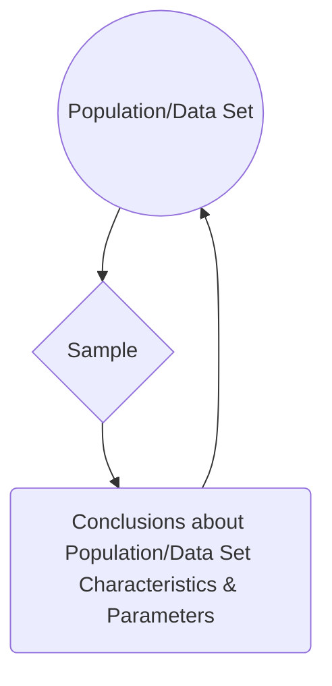
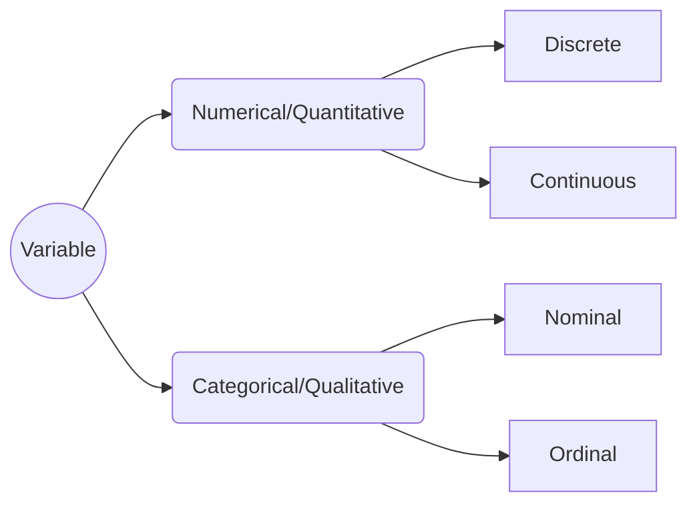

# Statistics 101
Definition: a set of techniques to organize, describe, analyze, and interpret data systematically, with the ultimate goal of extracting conclusions from said data.

Alternatively:
> “If you torture the data long enough, it will confess.” - Ronald Coase

Statistics can be divided into four areas:

 1. Descriptive Statistics
 2. Probability
 3. Sampling
 4. Inferential Statistics

Let's take a closer look at each one:

### Descriptive Statistics
Focuses on organizing and describing data. Can be further subdivided into two:
 - Position or central tendency measurements, such as mean, median, mode, and quantiles --- i.e. **how concentrated data is**.
 - Dispersion measurements, such as standard deviation, variance, and covariance --- i.e. **how scattered data is, *in* relation to a position measurement**.

### Probability
Allows us to describe phenomena that present uncertainty or randomness in a numerical form.

### Sampling
Procedures for selecting a sample from a given population, looking to obtain information from certain characteristics of interest that might lead to conclusions about the parameters of said population.

### Inferential Statistics
Comprises methods that enable extrapolating conclusions obtained from a sample to the whole of the population or data set.

All together:

## Variable Types

To distinguish between discrete and continuous, ask *"is this countable (only whole numbers/integers) or measurable (any value within a range, including fractions and decimals)?"* --- e.g. number of students in a class or results of rolling a dice (discrete) vs. a person's height or time taken to finish a race (continuous).

To distinguish between nominal and ordinal, ask *"does this have an specific order or intrinsic hierarchy to it?"* --- e.g. race or gender (nominal) vs. educational stage or rating scale (ordinal).

## Measures of Central Tendency

As stated above, measures of central tendency, also known as position measures, tell us how **concentrated** data is.

### Mean
There are various types of means, all based on the concept of an average --- i.e. a single number taken as representative of a list of numbers. The most known is the **arithmetic mean**, which is simply the sum of all elements in a set divided by the number of elements of said set. For a sample $x_{1},x_{2},\ldots ,x_{n}$ :

$$
{\displaystyle {\bar {x}}={\frac {1}{n}}\left(\sum _{i=1}^{n}{x_{i}}\right)={\frac {x_{1}+x_{2}+\cdots +x_{n}}{n}}}
$$

It is commonly just called *the* average, but it's better to specify depending in context. For a variable with independent realizations (where the occurrence of each does not affect the probability of occurrence of the others), it is the theoretical expected value.

A second type is the **geometric mean**. Instead of the sum of elements, it uses the product of their values, being the *n*th root of this: 

$$
{\displaystyle {\bar {x}}=\left(\prod _{i=1}^{n}x_{i}\right)^{\frac {1}{n}}={\sqrt[{n}]{x_{1}x_{2}\cdots x_{n}}}}
$$

This measure is better when we are looking at sets interpreted according to their product, such as rates of growth or widely different magnitudes.

Thirdly, we have the **harmonic mean**. It's defined by the number of elements divided by the sum of their reciprocals (multiplicative inverses). I know it sounds bewildering, but in this case the formula makes it clearer:

$$
{\displaystyle {\bar {x}}={\frac {1}{{\dfrac {1}{n}}\displaystyle \sum \limits _{i=1}^{n}{\frac {1}{x_{i}}}}}={\frac {n}{{\frac {1}{x_{1}}}+{\frac {1}{x_{2}}}+\cdots +{\frac {1}{x_{n}}}}}}
$$

This is used for sets defined in relation to some unit --- e.g. speed (distance per unit of time) or certain price indices in economics (prices across time periods).

These three are known as the Pythagorean means. All together:

$$
{\displaystyle {\begin{aligned}\operatorname {AM} \left(x_{1},\;\ldots ,\;x_{n}\right)&={\frac {1}{n}}\left(x_{1}+\;\cdots \;+x_{n}\right)\\[9pt]\operatorname {GM} \left(x_{1},\;\ldots ,\;x_{n}\right)&={\sqrt[{n}]{\left\vert x_{1}\times \,\cdots \,\times x_{n}\right\vert }}\\[9pt]\operatorname {HM} \left(x_{1},\;\ldots ,\;x_{n}\right)&={\frac {n}{\displaystyle {\frac {1}{x_{1}}}+\;\cdots \;+{\frac {1}{x_{n}}}}}\end{aligned}}}
$$

They also follow these inequalities:

$$
{\displaystyle \mathrm {AM} \geq \mathrm {GM} \geq \mathrm {HM} \,}
$$

Notice they are in alphabetical order. The equality case only applies if all set elements have the exact same value. Let's put it all together with a simple example. Given the numbers 4, 36, 45, 50, and 75:

$$
{\displaystyle {AM}={\frac {4+36+45+50+75}{5}}={\frac {210}{5}}=42}
$$

$$
{\displaystyle {GM}=(4\times 36\times 45\times 50\times 75)^{\frac {1}{5}}={\sqrt[{5}]{24\;300\;000}}=30}
$$

$$
{\displaystyle {HM}={\frac {5}{{\tfrac {1}{4}}+{\tfrac {1}{36}}+{\tfrac {1}{45}}+{\tfrac {1}{50}}+{\tfrac {1}{75}}}}={\frac {5}{\;{\tfrac {1}{3}}\;}}=15}
$$

We can see that the results satisfy the inequalities shown above.

### Median
A median is the number that divides the set into two parts of equal frequency --- i.e. the value at the 50th percentile. It can be simply thought as the "middle" value. Its difference from (and advantage over) the mean is that it is not skewed by very large or small values. Take the numbers 1, 2, 2, 3, 4, 7, and 9 for example. Their arithmetic mean is 4 (given that (1 + 2 + 2 + 3 + 4 + 7 + 9) / 7 = **4**), but the median is 3 (1, 2, 2, **3**, 4, 7, 9). If we have a set with an odd number of elements, the median will be the arithmetic mean of the two middle values --- e.g. for 1, 2, 3, **4, 5**, 6, 8, 9: (4 + 5) / 2 = **4.5**.

Another way of looking at it is as a more "typical" value. This is why it's used as the main indicator for evaluating income distribution (median household income).

### Mode
Very straightforward, the mode is the value that occurs most frequently in a given set of elements. Consequently, it has the highest probability of occurrence in a set without values grouped into classes. Given the numbers 4, 5, 4, 6, 5, 8, and 4, the mode is **4**, since it appears three times, more than any other. Note that the mode is not always unique: if two values are tied for the highest frequency, the set is said to be **bimodal**, and if more than two values are tied, **multimodal**.

TO BE CONTINUED...

> Written with [StackEdit](https://stackedit.io/).

