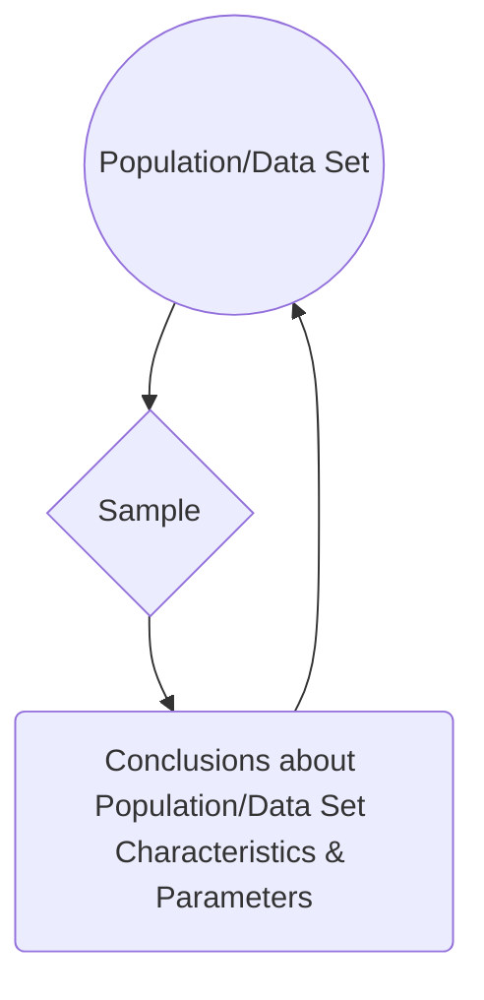
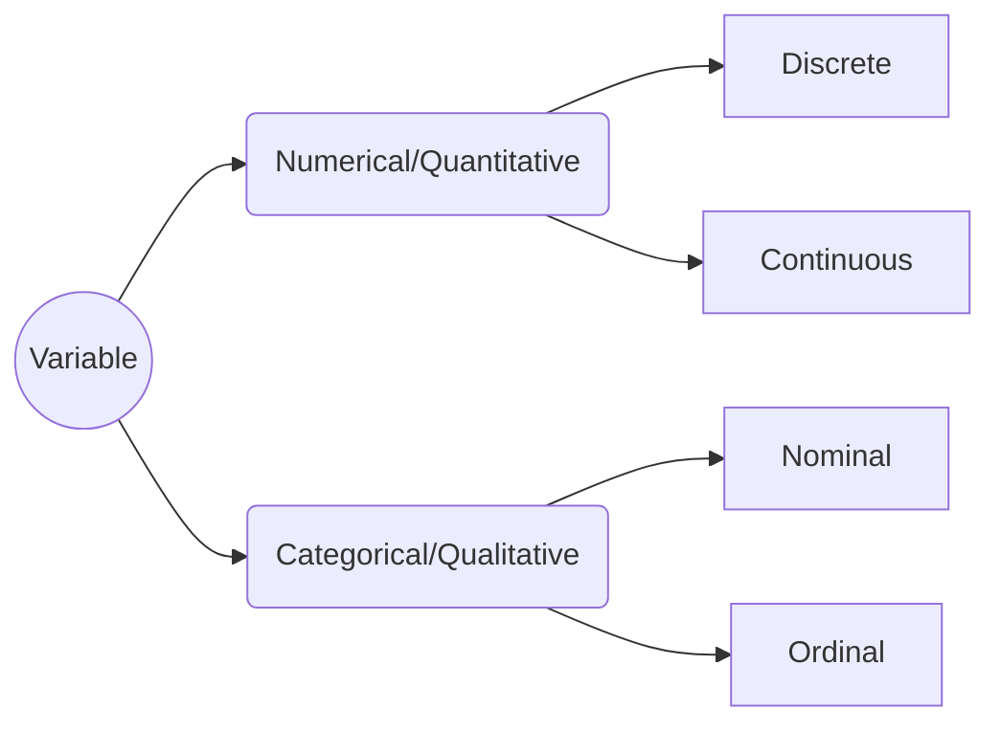

# Statistics 101
Definition: a set of techniques to organize, describe, analyze, and interpret data systematically, with the ultimate goal of extracting conclusions from said data.

Alternatively:
> “If you torture the data long enough, it will confess.” - Ronald Coase

Statistics can be divided into four areas:

 1. Descriptive Statistics
 2. Probability
 3. Sampling
 4. Inferential Statistics

Let's take a closer look at each one:

### Descriptive Statistics
Focuses on organizing and describing data. Can be further subdivided into two:
 - Measures of central tendency, such as mean, median, mode, and quantiles --- i.e. **how concentrated data is**.
 - Measures of dispersion, such as standard deviation, variance, and covariance --- i.e. **how scattered data is, *in* relation to a measure of central tendency**.

### Probability
Allows us to describe phenomena that present uncertainty or randomness in a numerical form.

### Sampling
Procedures for selecting a sample from a given population, looking to obtain information from certain characteristics of interest that might lead to conclusions about the parameters of said population.

### Inferential Statistics
Comprises methods that enable extrapolating conclusions obtained from a sample to the whole of the population or data set.

All together:

## Variable Types

To distinguish between discrete and continuous, ask *"is this countable (only whole numbers/integers) or measurable (any value within a range, including fractions and decimals)?"* --- e.g. number of students in a class or results of rolling a dice (discrete) vs. a person's height or time taken to finish a race (continuous).

To distinguish between nominal and ordinal, ask *"does this have an specific order or intrinsic hierarchy to it?"* --- e.g. race or gender (nominal) vs. educational stage or rating scale (ordinal).

## Measures of Central Tendency

As stated above, measures of central tendency, also known as position measures, tell us how **concentrated** data is.

### Mean
There are various types of means, all based on the concept of an average --- i.e. a single number taken as representative of a list of numbers. The most known is the **arithmetic mean**, which is simply the sum of all elements in a set divided by the number of elements of said set. For a sample  :

It is colloquially just called *the* average, but it's better to specify depending in context. For a variable with independent realizations (where the occurrence of each does not affect the probability of occurrence of the others), it is the theoretical **expected value**.

A second type is the **geometric mean**. Instead of the sum of elements, it uses the product of their values, being the *n*th root of this:

This measure is better when we are looking at sets interpreted according to their product, such as rates of growth or widely different magnitudes.

Thirdly, we have the **harmonic mean**. It's defined by the number of elements divided by the sum of their reciprocals (multiplicative inverses). I know it sounds bewildering, but in this case the formula makes it clearer:

This is used for sets defined in relation to some unit --- e.g. speed (distance per unit of time) or certain price indices in economics (prices across time periods).

These three are known as the Pythagorean means. All together:

They also follow these inequalities:

Notice they are in alphabetical order. The equality case only applies if all set elements have the exact same value. Let's put it all together with a simple example. Given the numbers 4, 36, 45, 50, and 75:

We can see that the results satisfy the inequalities shown above.

### Median
A median is the number that divides the set into two parts of equal frequency --- i.e. the value at the 50th percentile. It can be simply thought as the "middle" value. Its difference from (and advantage over) the mean is that it is not skewed by very large or small values. Take the numbers 1, 2, 2, 3, 4, 7, and 9 for example. Their arithmetic mean is 4 (given that (1 + 2 + 2 + 3 + 4 + 7 + 9) / 7 = **4**), but the median is 3 (1, 2, 2, **3**, 4, 7, 9). If we have a set with an odd number of elements, the median will be the arithmetic mean of the two middle values --- e.g. for 1, 2, 3, **4, 5**, 6, 8, 9: (4 + 5) / 2 = **4.5**.

Another way of looking at it is as a more "typical" value. This is why it's used as the main indicator for evaluating income distribution (median household income).

### Mode
Very straightforward, the mode is the value that occurs most frequently in a given set of elements. Consequently, it has the highest probability of occurrence in a set without values grouped into classes. Given the numbers 4, 5, 4, 6, 5, 8, and 4, the mode is **4**, since it appears three times, more than any other. Note that the mode is not always unique: if two values are tied for the highest frequency, the set is said to be **bimodal**, and if more than two values are tied, **multimodal**.

## Quantiles

Quantiles are simply the result of dividing your data into equal and adjacent subgroups. They can also be called fractiles. The median, as seen above, is the quantile that divides the sample into halves. Besides the median, the most used are qua**r**tiles and percentiles. Quartiles divide the data into four parts, or quarters. So, the first quartile (Q1) is the middle number between the smallest data point and the median. (It can also be called the lower quartile.) The second quartile (Q2) is equal to the median, and the third or upper quartile (Q3) is exactly between the median and the highest data point. Percentiles (also known as centiles), on the other hand, divide the data into a hundred parts, so they are equivalent to percentages. So, for example, the 30th percentile marks the value below which 30% of the sample remains. It's easy then to derive that the 25th percentile is equal to Q1, the 50th to Q2 (and the median), and the 75th to Q3.

## Skewness

Skewness is the measure of asymmetry of your data. With a perfectly symmetrical, or normal, distribution (the famous bell curve), our position measures will be equal and skewness with be equal to zero. However, many data sets we encounter are not symmetrical, and so their position measures will vary:

A negative or left-skewed distribution has a long tail on the left, and a skewness lower than zero. The median and mean also move to the left of the peak where the mode is, with the mean further away from it. The opposite is true for a positive or right-skewed distribution.

There are several ways to calculate asymmetry. Pearson's first and second coefficients of skewness are the ones most used. For the first, subtract the mode from the mean and divide the difference by the standard deviation of the sample:

Don't worry, we'll cover what standard deviation is later. Pearson's first coefficient is better when the data presents a strong mode. When the data has a weak mode or is multimodal (see above), the second is preferable, as it uses the median instead:

## Kurtosis

We can think of kurtosis as the "tailedness" of the data. The higher it is, the greater the extension of data farther from the mean and the more outliers, and vice versa. A normal distribution (more on it later) has a kurtosis value of 3 (**mesokurtic**). Distributions with a lower value are called **platykurtic** (less outliers) and with a higher one **leptokurtic** (more outliers).

Using the standard value 3 is referred to as Pearson's kurtosis (this guy is everywhere). It's common to adjust this by subtracting 3 so the normal kurtosis becomes zero. This is called excess kurtosis. Graphically:

A painless approach to calculating it is to use the percentile coefficient of kurtosis:

The distance between Q3 and Q1 is the interquartile range (IQR), commonly seen as the "box" of a boxplot.

## Measures of Dispersion

As we saw in the beginning, measures of dispersion tell us how **scattered** data is, ***in relation to*** a position measure, usually one of the means.

### Range
Simply the difference between the largest and smallest values in the sample. It just gives a very rough idea of how scattered the data is, since it's extremely distorted by outliers:

### Variance
As suggested by the name, measures how far data is spread from its average value:

However, it's not expressed in any particular unit, so it's not very useful as an indicator by itself.

### Standard Deviation
Like variance, it measures the dispersion of a sample. Unlike variance, it's expressed in the same units as the data. The lower it is, the more the values tend to be close to the mean, and vice versa (remember that the arithmetic mean is the theoretical expected value as well). To calculate it, simply take the square root of the variance:

Standard deviation is often used to measure the *confidence* of statistical conclusions --- e.g. the margin of error in electoral and similar polls. You can often hear this being called the **standard error**. It is determined by evaluating all the means calculated from a population if an "infinite" number of samples were to be drawn from it. Likewise, it's used in science as a measure of *significance* when only results higher than two standard deviations from the mean are considered statistically significant.

The **normal distribution**, also known as Gaussian or the bell curve (even though many other distributions are bell-shaped too), is a very, if not the most, important distribution in statistics. *Generating independent random variables will converge to a normal distribution as the sample increases in size.* We observe that many phenomena in nature and society follow this pattern, and we often do not know the actual distribution of the population (remember that one of the reasons we use samples is because it's unfeasible or impossible to study the population itself as a whole), so we ascribe a normal distribution to them in our analysis.

For the purposes seen above, it's conventional to divide the standard deviations of a normal distribution in percentages that follow the **68–95–99.7 rule**, also known as the **empirical rule**:

### Coefficient of Variation
This gives us a standardized measure of the dispersion of a distribution, most often in percentage form. It lacks units of measurement, but in general a value under 25% indicates that the data is fairly homogeneous (data points are similar to each other). It's also known as the *relative* standard deviation (RSD):

### Covariance
We regularly need to look at more than just one variable. **Covariance** helps us measure the joint variability of two variables --- i.e. how much they walk together. When the higher and lower values of one variable mostly correspond with the higher and lower values of the other, covariance will be positive (greater than zero). Conversely, when the higher values of one variable mostly correspond with the lower values of the other, covariance will be negative (lower than zero). Lastly, if covariance is equal or near zero, the variables are uncorrelated. For two samples  and :

## Conclusion
Statistics is a fascinating and exciting discipline that's always near us, even if unnoticed. If the laws of nature are indeed written in the language of mathematics, statistics is an essential dialect, important not only to data scientists, but for almost anyone in almost every field. I hope this small introduction was helpful and inspires your further knowledge journey.

*To improve: change equations to LaTeX, instead of linked images.*

> Written with [StackEdit](https://stackedit.io/).

