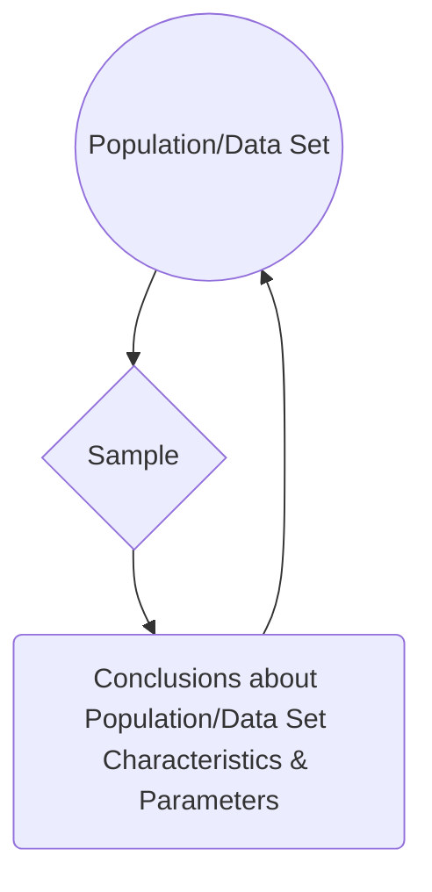
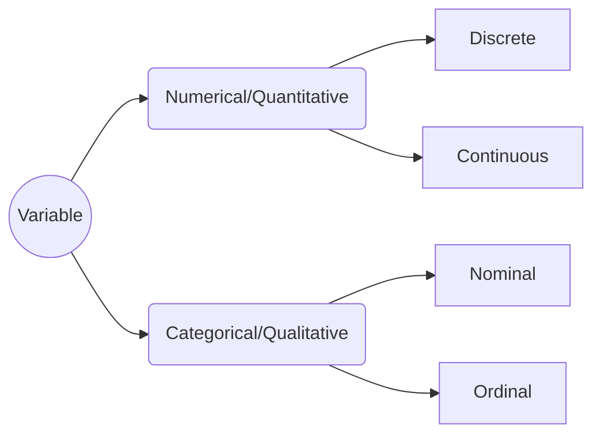

# Statistics 101
Definition: a set of techniques to organize, describe, analyze, and interpret data systematically, with the ultimate goal of extracting conclusions from said data.

Alternatively:
> “If you torture the data long enough, it will confess.” - Ronald Coase

Statistics can be divided into four areas:

 1. Descriptive Statistics
 2. Probability
 3. Sampling
 4. Inferential Statistics

Let's take a closer look at each one:

### Descriptive Statistics
Focuses on organizing and describing data. Can be further subdivided into two:
 - Position or central tendency measurements, such as mean, median, mode, and quantiles --- i.e. **how concentrated data is**.
 - Dispersion measurements, such as standard deviation, variance, and covariance --- i.e. **how scattered data is, *in* relation to a position measurement**.

### Probability
Allows us to describe phenomena that present uncertainty or randomness in a numerical form.

### Sampling
Procedures for selecting a sample from a given population, looking to obtain information from certain characteristics of interest that might lead to conclusions about the parameters of said population.

### Inferential Statistics
Comprises methods that enable extrapolating conclusions obtained from a sample to the whole of the population or data set.

All together:

## Variable Types

To distinguish between discrete and continuous, ask *"is this countable (only whole numbers/integers) or measurable (any value within a range, including fractions and decimals)?"* --- e.g. number of students in a class or results of rolling a dice (discrete) vs. a person's height or time taken to finish a race (continuous).

To distinguish between nominal and ordinal, ask *"does this have an specific order or intrinsic hierarchy to it?"* --- e.g. race or gender (nominal) vs. educational stage or rating scale (ordinal).

## NEXT

> Written with [StackEdit](https://stackedit.io/).

