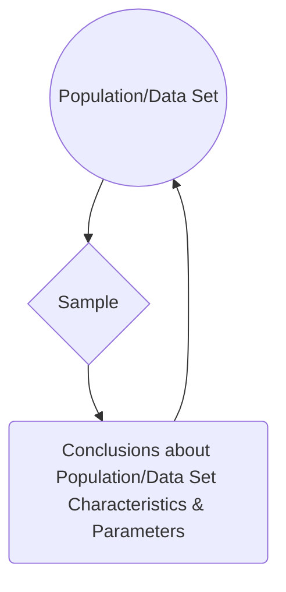
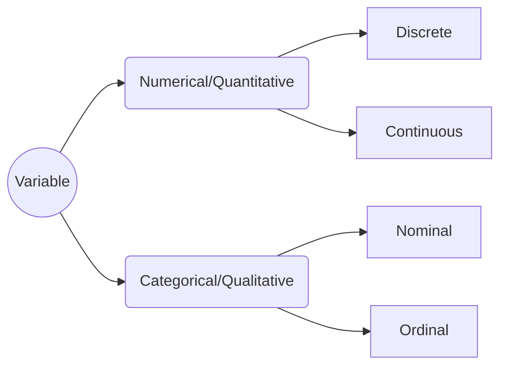

# Statistics 101
Definition: a set of techniques to organize, describe, analyze, and interpret data systematically, with the ultimate goal of extracting conclusions from said data.

Alternatively:
> “If you torture the data long enough, it will confess.” - Ronald Coase

Statistics can be divided into four areas:

 1. Descriptive Statistics
 2. Probability
 3. Sampling
 4. Inferential Statistics

Let's take a closer look at each one:

### Descriptive Statistics
Focuses on organizing and describing data. Can be further subdivided into two:
 - Measures of central tendency, such as mean, median, mode, and quantiles --- i.e. **how concentrated data is**.
 - Measures of dispersion, such as standard deviation, variance, and covariance --- i.e. **how scattered data is, *in* relation to a measure of central tendency**.

### Probability
Allows us to describe phenomena that present uncertainty or randomness in a numerical form.

### Sampling
Procedures for selecting a sample from a given population, looking to obtain information from certain characteristics of interest that might lead to conclusions about the parameters of said population.

### Inferential Statistics
Comprises methods that enable extrapolating conclusions obtained from a sample to the whole of the population or data set.

All together:

## Variable Types

To distinguish between discrete and continuous, ask *"is this countable (only whole numbers/integers) or measurable (any value within a range, including fractions and decimals)?"* --- e.g. number of students in a class or results of rolling a dice (discrete) vs. a person's height or time taken to finish a race (continuous).

To distinguish between nominal and ordinal, ask *"does this have an specific order or intrinsic hierarchy to it?"* --- e.g. race or gender (nominal) vs. educational stage or rating scale (ordinal).

## Measures of Central Tendency

As stated above, measures of central tendency, also known as position measures, tell us how **concentrated** data is.

### Mean
There are various types of means, all based on the concept of an average --- i.e. a single number taken as representative of a list of numbers. The most known is the **arithmetic mean**, which is simply the sum of all elements in a set divided by the number of elements of said set. For a sample  :

It is colloquially just called *the* average, but it's better to specify depending in context. For a variable with independent realizations (where the occurrence of each does not affect the probability of occurrence of the others), it is the theoretical expected value.

A second type is the **geometric mean**. Instead of the sum of elements, it uses the product of their values, being the *n*th root of this:

This measure is better when we are looking at sets interpreted according to their product, such as rates of growth or widely different magnitudes.

Thirdly, we have the **harmonic mean**. It's defined by the number of elements divided by the sum of their reciprocals (multiplicative inverses). I know it sounds bewildering, but in this case the formula makes it clearer:

This is used for sets defined in relation to some unit --- e.g. speed (distance per unit of time) or certain price indices in economics (prices across time periods).

These three are known as the Pythagorean means. All together:

They also follow these inequalities:

Notice they are in alphabetical order. The equality case only applies if all set elements have the exact same value. Let's put it all together with a simple example. Given the numbers 4, 36, 45, 50, and 75:

We can see that the results satisfy the inequalities shown above.

### Median
A median is the number that divides the set into two parts of equal frequency --- i.e. the value at the 50th percentile. It can be simply thought as the "middle" value. Its difference from (and advantage over) the mean is that it is not skewed by very large or small values. Take the numbers 1, 2, 2, 3, 4, 7, and 9 for example. Their arithmetic mean is 4 (given that (1 + 2 + 2 + 3 + 4 + 7 + 9) / 7 = **4**), but the median is 3 (1, 2, 2, **3**, 4, 7, 9). If we have a set with an odd number of elements, the median will be the arithmetic mean of the two middle values --- e.g. for 1, 2, 3, **4, 5**, 6, 8, 9: (4 + 5) / 2 = **4.5**.

Another way of looking at it is as a more "typical" value. This is why it's used as the main indicator for evaluating income distribution (median household income).

### Mode
Very straightforward, the mode is the value that occurs most frequently in a given set of elements. Consequently, it has the highest probability of occurrence in a set without values grouped into classes. Given the numbers 4, 5, 4, 6, 5, 8, and 4, the mode is **4**, since it appears three times, more than any other. Note that the mode is not always unique: if two values are tied for the highest frequency, the set is said to be **bimodal**, and if more than two values are tied, **multimodal**.

## Quantiles

Quantiles are simply the result of dividing your data into equal and adjacent subgroups. They can also be called fractiles. The median, as seen above, is the quantile that divides the sample into halves. Besides the median, the most used are qua**r**tiles and percentiles. Quartiles divide the data into four parts, or quarters. So, the first quartile (Q1) is the middle number between the smallest data point and the median. (It can also be called the lower quartile.) The second quartile (Q2) is equal to the median, and the third or upper quartile (Q3) is exactly between the median and the highest data point. Percentiles (also known as centiles), on the other hand, divide the data into a hundred parts, so they are equivalent to percentages. So, for example, the 30th percentile marks the value below which 30% of the sample remains. It's easy then to derive that the 25th percentile is equal to Q1, the 50th to Q2 (and the median), and the 75th to Q3.

## Skewness

Skewness is the measure of asymmetry of your data. With a perfectly symmetrical, or normal, distribution (the famous bell curve), our position measures will be equal and skewness with be equal to zero. However, many data sets we encounter are not symmetrical, and so their position measures will vary:

A negative or left-skewed distribution has a long tail on the left, and a skewness lower than zero. The median and mean also move to the left of the peak where the mode is, with the mean further away from it. The opposite is true for a positive or right-skewed distribution.

There are several ways to calculate asymmetry. Pearson's first and second coefficients of skewness are the ones most used. For the first, subtract the mode from the mean and divide the difference by the standard deviation of the sample:

... Don't worry, we'll see what exactly standard deviation is later. (Edit sentence?)

*"Pearson’s second coefficient of skewness, or Pearson median skewness, subtracts the median from the mean, multiplies the difference by three and divides the product by the standard deviation."
"Pearson’s first coefficient of skewness is useful if the data exhibit a strong mode. If the data have a weak mode or multiple modes, Pearson’s second coefficient may be preferable, as it does not rely on mode as a measure of central tendency."*

## Kurtosis

*"Kurtosis (from Greek: κυρτός, kyrtos or kurtos, meaning "curved, arching") is a measure of the "tailedness" of the probability distribution of a real-valued random variable. Like skewness, kurtosis describes the shape of a probability distribution and there are different ways of quantifying it for a theoretical distribution and corresponding ways of estimating it from a sample from a population.
This number is related to the tails of the distribution, not its peak;[2] hence, the sometimes-seen characterization of kurtosis as "peakedness" is incorrect. For this measure, higher kurtosis corresponds to greater extremity of deviations (or outliers), and not the configuration of data near the mean.
The kurtosis of any univariate normal distribution is 3. It is common to compare the kurtosis of a distribution to this value. Distributions with kurtosis less than 3 are said to be platykurtic, although this does not imply the distribution is "flat-topped" as is sometimes stated. Rather, it means the distribution produces fewer and less extreme outliers than does the normal distribution. An example of a platykurtic distribution is the uniform distribution, which does not produce outliers. Distributions with kurtosis greater than 3 are said to be leptokurtic. An example of a leptokurtic distribution is the Laplace distribution, which has tails that asymptotically approach zero more slowly than a Gaussian, and therefore produces more outliers than the normal distribution. It is also common practice to use an adjusted version of Pearson's kurtosis, the excess kurtosis, which is the kurtosis minus 3, to provide the comparison to the standard normal distribution."*

TO BE CONTINUED...
*To improve: change equations to LaTeX, instead of linked images.*

> Written with [StackEdit](https://stackedit.io/).

